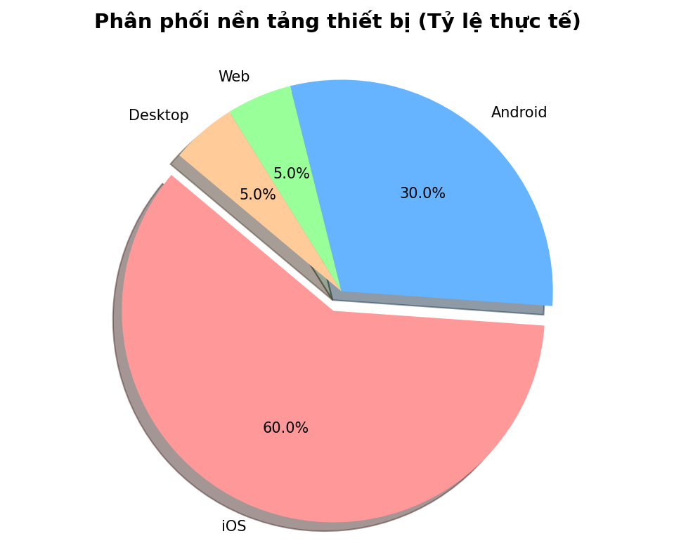
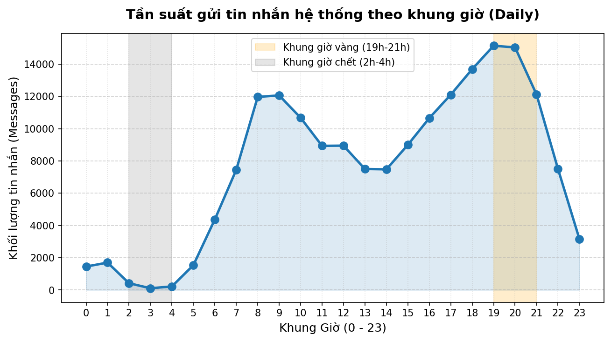
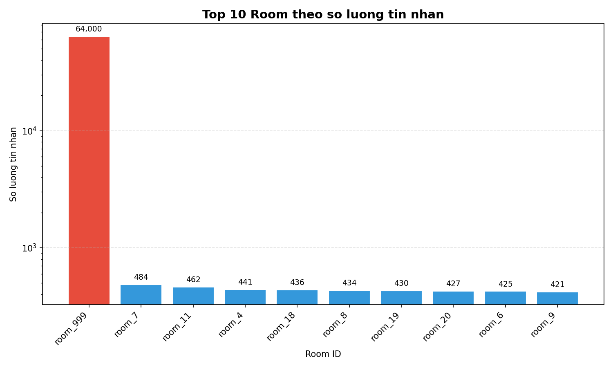

# Báo Cáo Tiến Độ Phase 3

## 0. Tổng quan Dữ liệu Nguồn (EDA)

Kết quả phân tích từ tập dữ liệu giả lập (mock data) trên Cassandra:

*(Nền tảng iOS chiếm 60%, Android 30%, phản ánh đúng đặc thù nền tảng di động).*

*(Lượng tin nhắn tập trung vào khung giờ trưa và 19h-21h, giảm dần về rạng sáng).*

## 1. Mục tiêu công việc
Xây dựng pipeline ETL bằng PySpark để di dời dữ liệu (data migration) từ Cassandra sang cụm ScyllaDB mới.

## 2. Quá trình triển khai (Tuần 5)

**Cấu hình môi trường:** Lỗi thiếu thư viện `ClassNotFound` khi kết nối Cassandra được xử lý bằng cách khai báo biến môi trường `PYSPARK_SUBMIT_ARGS`, giúp Spark tự động tải gói dependency (`.jar`) khi khởi chạy.

**Xử lý Hot Partition bằng Time-bucketing:** Từ kết quả EDA, các phòng chat có lưu lượng lớn gây ra hiện tượng Hot Partition trên một số Node.

Giải pháp: Bổ sung trường `bucket_id` (định dạng `yyyy-MM`) vào khóa chính ở bước Transform. Dữ liệu của các phòng chat được phân tán theo từng tháng, giúp phân bổ tải trọng đồng đều lên các Node. Việc áp dụng logic bucketing đồng nhất (thay vì động) giúp giữ cho truy vấn Backend đơn giản (không cần bảng tra cứu).

**Ghi dữ liệu (Load):** Pipeline sử dụng phương thức `.mode("append")` để ghi dữ liệu, đảm bảo không ghi đè lên các bản ghi hiện có tại ScyllaDB.

## 3. Tối ưu hóa hiệu năng I/O (Tuần 6)

Để cải thiện tốc độ ghi dữ liệu vào ScyllaDB, cờ `--mode optimized` được thiết lập nhằm kích hoạt các cấu hình nâng cao trong Spark:
- **`spark.cassandra.output.batch.size.bytes`**: Đặt ở mức `65536` bytes để tối ưu hóa kích thước batch, giảm overhead mạng.
- **`spark.cassandra.output.concurrent.writes`**: Sử dụng `10` luồng ghi đồng thời để tăng hiệu suất IOPS.
- **`spark.cassandra.connection.keepAliveMS`**: Duy trì kết nối trong `10000` ms (10 giây) để tái sử dụng connection pool.

Kết quả: Thông lượng ghi (write throughput) cải thiện đáng kể so với cấu hình mặc định.

## 4. Hệ thống Cold Archiver (Tuần 7)

Kịch bản `cold_archiver.py` được triển khai để di chuyển các dữ liệu cũ sang kho lưu trữ dài hạn (S3/Local Disk), giảm chi phí và tối ưu dung lượng cho database chính.

**Chi tiết kỹ thuật:**
- Sử dụng module `datetime` để lọc các bản ghi có thời gian tạo lớn hơn 6 tháng.
- Dữ liệu được xuất ra định dạng **Parquet** tối ưu cho truy vấn phân tích (OLAP).
- Cấu trúc thư mục được phân vùng bằng `partitionBy("year", "month")`, hỗ trợ các Query Engine truy xuất dữ liệu nhanh hơn.
- Script chỉ thực hiện đọc dữ liệu một lần (1-Pass) và loại bỏ các lệnh `.count()` nhằm tránh quá tải bộ nhớ (OOM).

Pipeline ETL hiện đã hoàn thiện và đáp ứng đầy đủ yêu cầu chuyển tiếp sang Phase 4 (Phân tích NLP).
