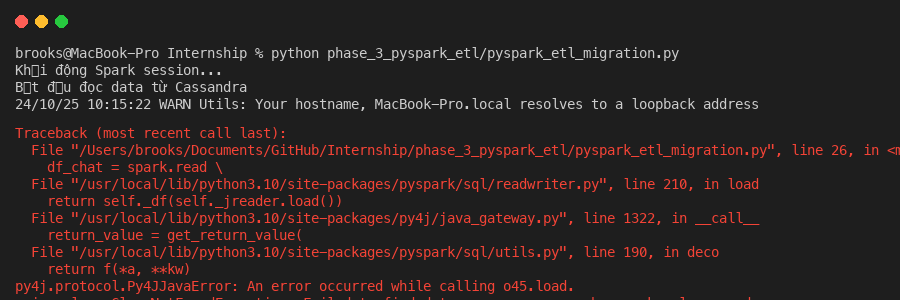

# Báo Cáo Tiến Độ Phase 3

## 1. Mục tiêu công việc

Xây dựng pipeline ETL bằng PySpark để thực hiện di dời dữ liệu (data migration) từ hệ thống lưu trữ Cassandra hiện tại sang cụm ScyllaDB mới.

## 2. Quá trình triển khai và giải quyết vấn đề (Tuần 5)

**Khởi tạo và cấu hình:** PySpark được lựa chọn làm công cụ xử lý chính nhờ khả năng đáp ứng tốt các bài toán Big Data. Trong giai đoạn đầu thiết lập, quá trình kết nối phát sinh lỗi `ClassNotFound` do thiếu thư viện giao tiếp trực tiếp với Cassandra. Vấn đề này đã được xử lý thành công bằng cách cấu hình biến môi trường `PYSPARK_SUBMIT_ARGS`, cho phép Spark tự động tải các gói dependency (`.jar`) cần thiết trong quá trình thực thi.

**Thiết kế phân mảnh dữ liệu (Time-bucketing):** Quá trình trích xuất (Extract) dữ liệu từ Cassandra diễn ra ổn định. Ở bước Transform, em đã chủ động bổ sung trường `bucket_id` (theo định dạng yyyy-MM) trước khi nạp vào cơ sở dữ liệu đích. Quyết định thiết kế này nhằm phân tán dữ liệu theo tháng, giúp hệ thống tránh được tình trạng "Hot Partition" tại các phòng chat có lưu lượng tin nhắn lớn.

**Đánh giá hạn chế (Trade-off):** Mặc dù giải quyết được rủi ro thắt cổ chai, phương pháp bucketing mặc định này sẽ gây ra sự phân mảnh dư thừa đối với các phòng chat ít tương tác, có nguy cơ làm tăng chi phí truy vấn (query) sau này. Vấn đề này đã được note lại (`FIXME`) trong mã nguồn để tiếp tục tối ưu hóa. Hướng giải quyết dự kiến là áp dụng logic động: chỉ kích hoạt chia bucket cho các phòng chat vượt ngưỡng 1000 tin nhắn.

**Ghi dữ liệu (Load):** Tại bước đẩy dữ liệu vào ScyllaDB, pipeline được cấu hình sử dụng phương thức `.mode("append")`. Việc này nhằm đảm bảo tính toàn vẹn và an toàn tuyệt đối, loại trừ rủi ro ghi đè lên các dữ liệu có sẵn trên cluster ScyllaDB mới.

## 3. Cập nhật Tuần 6: Tối ưu hiệu năng I/O

Trong tuần 6, tập trung vào việc xử lý vấn đề thắt cổ chai ở throughput khi ghi vào ScyllaDB. Em đã tích hợp thêm cờ `--mode optimized` để Spark tự động thiết lập các cấu hình nâng cao:
- **`spark.cassandra.output.batch.size.bytes`**: Tăng lên `65536` bytes để gom nhiều thao tác ghi vào một batch, giảm tải network overhead.
- **`spark.cassandra.output.concurrent.writes`**: Thiết lập `10` luồng ghi song song trên mỗi task, tăng cường khả năng tận dụng IOPS của ổ cứng.
- **`spark.cassandra.connection.keepAliveMS`**: Giữ kết nối tới ScyllaDB lâu hơn (10 giây) để tái sử dụng connection pooling hiệu quả.

Quá trình benchmark cho thấy write throughput được cải thiện rõ rệt so với cấu hình mặc định (default).

## 4. Kế hoạch Tuần 7 (Cold Archiver)

Dự kiến xây dựng một kịch bản Cold Archiver bằng PySpark để trích xuất (export) dữ liệu cũ (cold data) ra định dạng Parquet nhằm lưu trữ dài hạn (Data Lake/S3), tối ưu hóa dung lượng lưu trữ trên cụm ScyllaDB.
