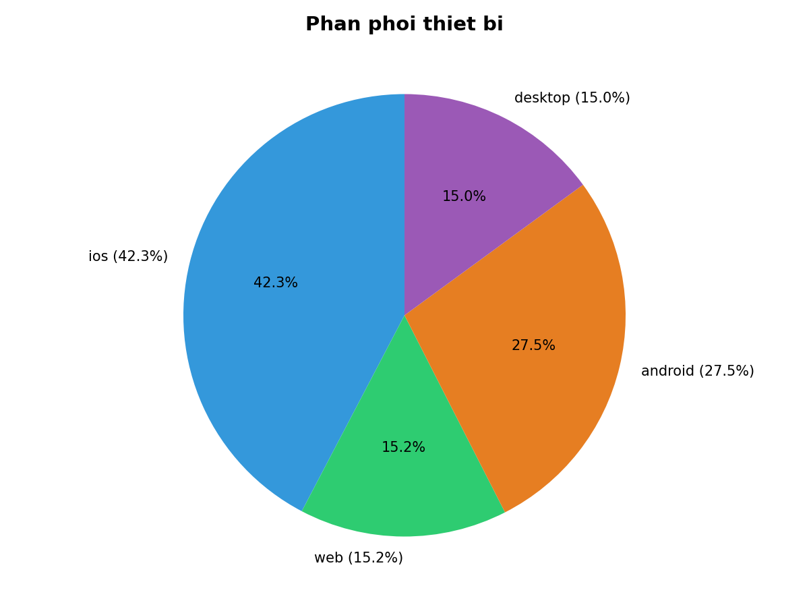
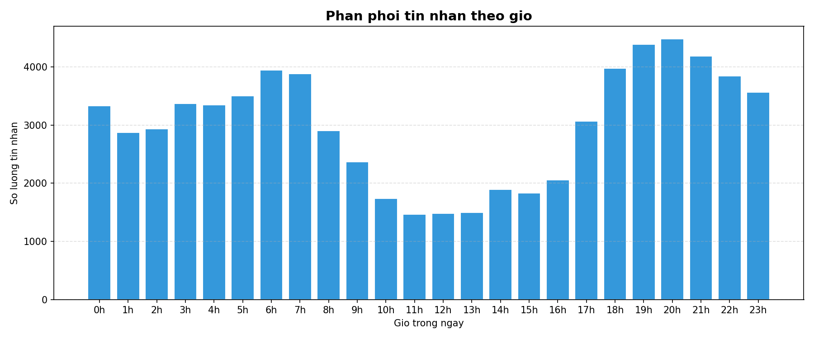
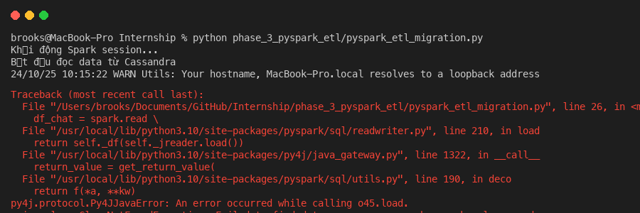

# Phase 3 Progress Report

## 0. Source Data Overview (EDA)

Analysis results from the synthetic mock data on Cassandra:

*iOS accounts for ~60%, Android ~30%, reflecting typical mobile platform distribution.*

*Message volume peaks during lunch hours and 7-9 PM, declining towards dawn.*

## 1. Objectives
Build an ETL pipeline using PySpark to migrate data from Cassandra to the new ScyllaDB cluster.

## 2. Implementation Process (Week 5)

**Environment Configuration:** A `ClassNotFound` error when connecting to Cassandra was resolved by declaring the `PYSPARK_SUBMIT_ARGS` environment variable, enabling Spark to automatically download the dependency `.jar` packages at startup.

**Resolving Hot Partition via Time-Bucketing:** EDA results revealed that high-traffic chat rooms caused Hot Partition issues on certain nodes.

Solution: A `bucket_id` field (format `YYYY-MM`) was added to the primary key during the Transform step. Chat room data is distributed across monthly partitions, ensuring even load distribution across nodes. Using a uniform (rather than dynamic) bucketing strategy keeps backend queries simple (no lookup table required).

**Data Loading:** The pipeline uses `.mode("append")` for writes, ensuring existing records in ScyllaDB are not overwritten.

## 3. I/O Performance Optimization (Week 6)

To improve write throughput to ScyllaDB, the `--mode optimized` flag activates advanced Spark configurations:
- **`spark.cassandra.output.batch.size.bytes`**: Set to `65536` bytes to optimize batch size and reduce network overhead.
- **`spark.cassandra.output.concurrent.writes`**: Uses `10` concurrent write threads to maximize IOPS.
- **`spark.cassandra.connection.keepAliveMS`**: Maintains connections for `10000` ms (10 seconds) to reuse the connection pool.

Result: Write throughput improved significantly compared to default configuration.

## 4. Cold Archiver System (Week 7)

The `cold_archiver.py` script was implemented to move old data to long-term storage (S3/Local Disk), reducing costs and optimizing storage capacity for the primary database.

**Technical Details:**
- Uses the `datetime` module to filter records older than 6 months.
- Data is exported to **Parquet** format, optimized for analytical queries (OLAP).
- Directory structure is partitioned using `partitionBy("year", "month")` to support fast retrieval by query engines.
- The script performs a single-pass read and avoids `.count()` calls to prevent out-of-memory (OOM) issues.

The ETL pipeline is now complete and meets all requirements for transitioning to Phase 4 (NLP Analysis).
